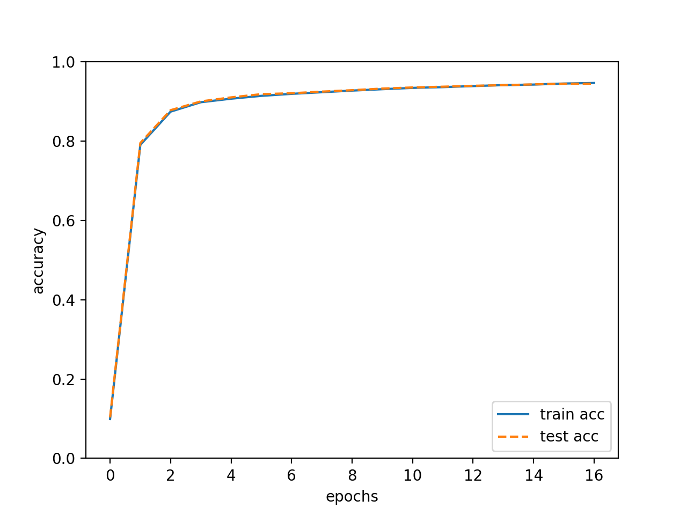

训练过程：
```
train acc : 0.1022, test acc : 0.1010
train acc : 0.7799, test acc : 0.7836
train acc : 0.8767, test acc : 0.8828
train acc : 0.9006, test acc : 0.9025
train acc : 0.9092, test acc : 0.9119
train acc : 0.9145, test acc : 0.9185
train acc : 0.9197, test acc : 0.9211
train acc : 0.9241, test acc : 0.9263
train acc : 0.9277, test acc : 0.9282
train acc : 0.9306, test acc : 0.9317
train acc : 0.9328, test acc : 0.9329
train acc : 0.9357, test acc : 0.9341
train acc : 0.9375, test acc : 0.9379
train acc : 0.9408, test acc : 0.9395
train acc : 0.9428, test acc : 0.9409
train acc : 0.9439, test acc : 0.9410
train acc : 0.9461, test acc : 0.9436
```

